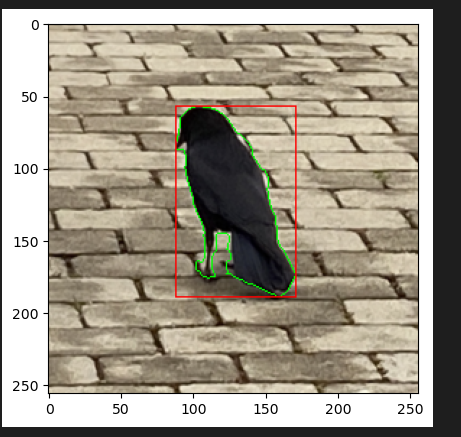

# Semantic Segmentation and Object Localization using U-Net

A complete, modular PyTorch implementation of a **U-Net Encoder-Decoder network** trained to segment birds on the CUB-200-2011 dataset, paired with an OpenCV post-processing pipeline for automated bounding-box localization. The original test picture is missing

## Project Structure
* `model.py`: Architectural script hosting structural modules (`ConvBlock`, `EncoderBlock`, `DecoderBlock`, and the full `UNet` system).
* `dataset.py`: Streamlines IO pipeline execution via high-capacity data generators.
* `train.py`: Handles loss optimization workflows alongside custom structural weight tracking using the Dice Coefficient.
* `inference.py`: A standalone post-processing diagnostic utility using OpenCV contour extractions.

## Network Topology & Deep Features
The system follows the symmetrical contraction and expansion architecture proposed by Ronneberger et al:
* **Contracting Path:** 4 multi-channel downsampling blocks utilizing $3\times3$ convolutions followed by Batch Normalization, ReLU, and $2\times2$ Max Pooling operations.
* **Expansive Path:** Match-paired up-sampling paths utilizing $2\times2$ ConvTranspose operations.
* **Dynamic Skip-Connections:** Injected feature preservation logic that tracks asymmetrical grid properties on-the-fly via programmatic geometric adaptations using spatial resizing.

## Optimization Blueprint
* **Loss Function:** Binary Cross-Entropy with Logits (`BCEWithLogitsLoss`) evaluated across a pixel-wise layer array matrix.
* **Evaluation Metric:** Dice Coefficient tracking ensures precise spatial alignment, avoiding issues caused by class imbalances between small background fragments and foreground feature indicators.
* **Post-Processing Localization:** Predicted pixel regions are processed via contour tracking maps (`cv2.findContours`) to convert semantic binary output boundaries into actionable target boxes (`cv2.boundingRect`).